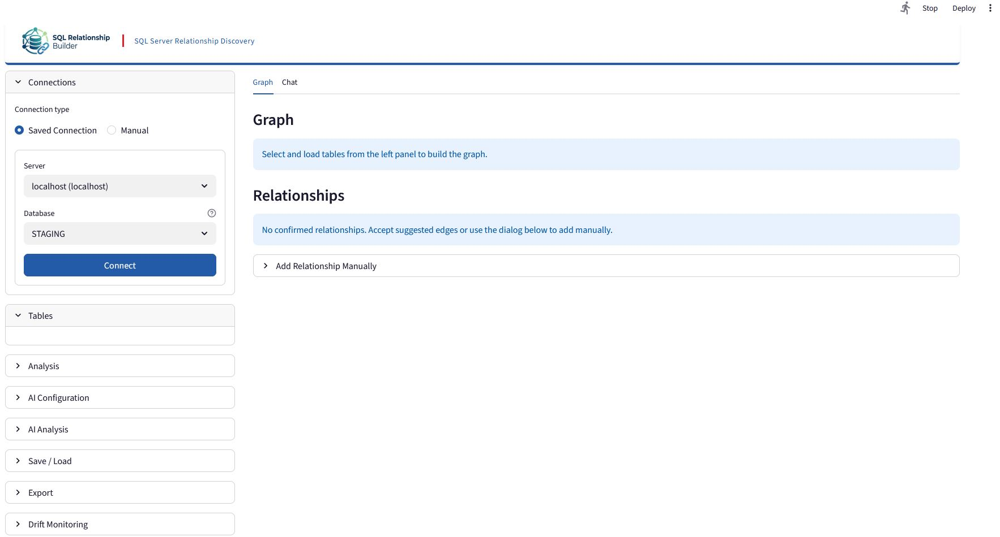
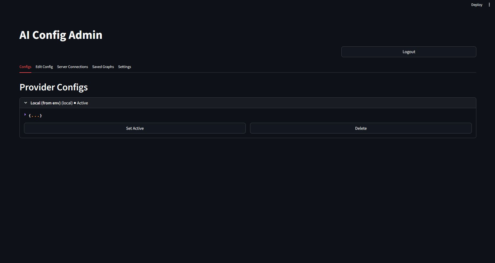

# SQL Relationship Builder -- Runbook

End-to-end execution guide for humans and AI agents.

## Overview

SQL Relationship Builder is a Streamlit app that discovers, scores, and curates
relationships (foreign keys and join paths) across SQL Server databases.

- **Connect & discover** — attach to one or more SQL Server instances, browse
  user tables, and auto-discover schema (columns, types, indexes, existing FK
  constraints). Cross-server relationships are detected.
- **Profile** — run column and string profiling (null ratios, distinct counts,
  top values, categorical detection, identifier patterns) to gather evidence.
- **Detect candidates deterministically** — generate candidate edges from name,
  type-compatibility, value-overlap, and string-evidence heuristics, plus any
  existing FK constraints, then score and rank them.
- **Curate in a graph** — review candidates on an interactive NetworkX/pyvis
  graph and accept, reject, or edit edges. Optional LLM-assisted candidate
  discovery is available.
- **Chat with your data** — ask natural-language questions about a saved graph;
  the LLM drafts a read-only T-SQL query, runs it against the connected
  database, and returns the result plus a plain-language answer.
- **Monitor drift** — snapshot the schema and detect schema drift over time.
- **Export & persist** — emit JSON and Markdown reports and save/restore
  relationship graphs.

The rest of this document is the operational runbook: prerequisites, the
step-by-step workflow, configuration reference, architecture, and troubleshooting.

## Screenshots

### Main app



The user-facing page: connections panel (left) for saved/manual SQL Server
connections and table selection, with the relationship Graph and AI Chat tabs
on the right.

### AI Config Admin



The admin panel (`admin/admin.py`) for managing AI provider configs, saved
server connections, and saved graphs. Provider configs are created and edited
from the "Edit Config" tab; the "Configs" tab lists them and lets you set the
active one or delete it.

## Prerequisites

- Python 3.11+
- UV package manager (`curl -LsSf https://astral.sh/uv/install.sh | sh`)
- ODBC Driver 17 for SQL Server (or compatible)
- Access to a SQL Server instance with read permissions

## Quick Start

```bash
# 1. Clone / navigate to project
cd streamlit_relationship_builder

# 2. Install dependencies
uv sync

# 3. Configure (optional)
cp config/defaults.yaml config/my_config.yaml
# Edit config/my_config.yaml with your alias groups, thresholds, exclusions

# 4. Launch
uv run streamlit run app.py
```

## Step-by-Step Workflow

### 1. Connect to SQL Server

- Open the app at `http://localhost:8501`
- Expand **Connections** panel (left sidebar)
- Enter:
  - **Server**: hostname or IP (e.g., `localhost\SQLEXPRESS`)
  - **Database**: database name
  - **Username** / **Password**: SQL Server credentials
- Click **Connect**

You can connect to multiple servers/databases simultaneously. Cross-server relationships will be detected.

### 2. Browse and Select Tables

- Expand **Tables** panel
- All user tables from connected databases appear in a multi-select
- Select the tables you want to include in the relationship set
- Click **Load Selected Tables**

On load, the app automatically:

- Discovers schema (columns, types, indexes, foreign keys)
- Runs profiling (null ratios, distinct counts, top values)
- Runs string profiling (categorical detection, identifier patterns)
- Adds existing FK constraints as confirmed edges

### 3. Run Analysis Pipeline

- Expand **Analysis** panel
- Click **Run Profiling** (auto-run on table load, but can re-run)
- Click **Run Analysis Pipeline**

The pipeline:

1. Generates candidate column pairs (exact name, alias, fuzzy match)
2. Evaluates type compatibility (canonical type families)
3. Computes value evidence (overlap, Jaccard, containment)
4. Computes string evidence (categorical alignment, token similarity)
5. Scores candidates with weighted formula
6. Adds high/medium/low confidence candidates as suggested edges

### 4. Review and Curate Relationships

**Right panel:**

- **Graph**: Interactive pyvis visualization (solid = confirmed, dashed = suggested)
- **Suggested Relationships**: List of candidates with confidence scores
  - Click **Accept** to confirm a relationship
  - Click **Dismiss** to reject a suggestion
- **Relationships**: Editable table for confirmed edges
  - Change relationship type (one-to-one, one-to-many, many-to-one, many-to-many)
  - Add/edit annotations
  - Click **Remove** to delete a relationship

**Add manually:**

- Expand **Add Relationship Manually** (right panel)
- Select source/target tables and columns
- Choose relationship type
- Click **Add Relationship**

**Annotations:**

- Expand **Annotations** (left panel)
- Add descriptions to tables and relationships

### 5. Monitor Schema Drift

- Expand **Drift Monitoring** (left panel)
- Click **Save Snapshot** to capture current schema state
- On subsequent runs, click **Check Drift** to compare against snapshot
- Reports: new tables, removed tables, column changes, type changes, row count changes
- Download drift report as markdown

### 6. Config Feedback Loop

- Expand **Config Feedback** (left panel)
- View current alias groups
- Add new alias groups from your review decisions
- Click **Export Updated Config** to download the modified config
- Use the updated config in future runs for improved detection

### 7. Export

- Expand **Export** (left panel)
- Set **Relationship Set Name**
- Click **Export Markdown** for `.md` file with:
  - YAML frontmatter (title, table count, relationship count)
  - Source database list
  - Table definitions with column types
  - Relationship matrix
  - Evidence summaries (for suggested edges)
  - Mermaid ER diagram
  - Annotations
- Click **Export JSON** for machine-readable `.json` with:
  - Full table metadata
  - Relationships with types and annotations
  - Suggested relationships with confidence and evidence
  - Summary statistics

### 8. Save and Restore

- Expand **Save / Load** (left panel)
- Click **Save** to persist current state to JSON (no credentials stored)
- Click **Load** to restore a previous session

### 9. Chat with your data

The **Chat** tab (next to **Graph**) lets you ask natural-language questions
against the live database and get back SQL plus an answer.

**Prerequisites:**

- An AI provider is configured (active config from the admin panel, or set in
  the **AI Configuration** left-panel section). Otherwise the tab shows
  "Configure an LLM provider in the left panel first."
- At least one graph is saved (**Save / Load**). Chat builds its schema context
  from that graph's confirmed relationships (and high-confidence cross-user
  suggestions).
- A reachable connection to the graph's database server. The chat auto-connects
  using the graph's `server\database`; if none is available it asks you to
  connect or save a server connection in admin.

**Usage:**

- Pick a graph from the **Active graph** dropdown.
- Type a question in **Ask a question** and click **Send** (or Ctrl+Enter).
- Each turn renders the generated T-SQL in a collapsible **View SQL**, the
  result set as a dataframe, and a plain-language **Answer**.

**Pipeline:** question + graph schema → LLM generates a single T-SQL `SELECT`
(temperature 0) → executes against the database → an answer synthesizer turns
the result into prose.

**Guardrails (read-only):**

- Only `SELECT` / `WITH` statements run; DDL/DML/`EXEC` (INSERT, UPDATE, DELETE,
  DROP, ALTER, MERGE, GRANT, etc.) are rejected before execution.
- A `TOP (1000)` row cap is injected when absent, and a 30-second query timeout
  applies.

**Conversations:** multi-turn follow-ups reuse recent context (history pruned to
the last 5 turns). Use **New Chat** to start fresh, **Clear** to wipe the current
turns, and **Export** to surface a **Download conversation JSON** button
(`chat_<graph>.json`) containing the questions, generated SQL, reasoning,
answers, and result sets.

## Configuration Reference

All configuration lives in `config/defaults.yaml`:

```yaml
thresholds:
  name_similarity_min: 0.6 # Minimum fuzzy name match score
  type_compatibility: strict # "strict" or "relaxed"
  value_overlap_min: 3 # Minimum overlapping values
  value_overlap_ratio: 0.05 # Minimum overlap ratio
  jaccard_min: 0.1 # Minimum Jaccard similarity
  confidence_high: 0.85 # Threshold for "high" band
  confidence_medium: 0.70 # Threshold for "medium" band
  confidence_low: 0.50 # Threshold for "low" band
  string_categorical_distinct_max: 20 # Max distinct for categorical

aliases:
  api: [api_number, api_num, well_api, api_no, well_number]
  well: [well_name, wellname, well_no, well_num]
  # Add your domain-specific aliases here

profiling:
  mode_a_max_rows: 100000 # Max rows for full pushdown
  mode_b_string_cardinality: 5000

exclusions:
  column_patterns: [] # Column name patterns to exclude
  table_patterns: [] # Table name patterns to exclude
```

## Architecture Overview

```
app.py (Streamlit UI)
  |
  +-- src/db.py           (SQL Server connection, schema discovery)
  +-- src/metadata.py     (Extended metadata: indexes, FKs, row counts)
  +-- src/profiler.py     (Adaptive profiling: Mode A/B/C)
  +-- src/string_profiler.py  (String column analysis)
  +-- src/candidates.py   (Candidate generation: exact/alias/fuzzy)
  +-- src/type_compat.py  (Type compatibility evaluation)
  +-- src/value_evidence.py   (Value overlap, Jaccard, containment)
  +-- src/string_evidence.py  (Categorical alignment, token similarity)
  +-- src/scoring.py      (Weighted confidence scoring)
  +-- src/pipeline.py     (Pipeline orchestrator)
  +-- src/graph.py        (Relationship graph: nodes, edges, serialization)
  +-- src/export.py       (Markdown + Mermaid + JSON export)
  +-- src/drift.py        (Schema drift detection)
  +-- src/state.py        (JSON save/load)
  +-- src/models.py       (Data models)
  +-- src/types.py        (Type canonicalization via sqlglot)
```

## Quality Gates

Run before release:

```bash
uv run python -m pytest tests/ -v
```

Gates checked:

1. **Evidence completeness**: All scored edges have type + value evidence
2. **Determinism**: Same config + same data = same outputs
3. **No hardcoded names**: Core modules contain no literal table/column names
4. **Config-driven**: Thresholds exist in `config/defaults.yaml`

## Admin Panel

A separate Streamlit page for managing AI provider configs, saved SQL Server connections, and saved relationship graphs.

```bash
streamlit run admin/admin.py --server.port 8550
```

Open http://localhost:8550. On first run you are prompted to set an admin password (stored as a bcrypt hash; there is no default).

| Tab | Purpose |
|-----|---------|
| Configs | List, create, delete AI provider configs; set the active one |
| Edit Config | Edit the selected config's endpoint, model, API key, parameters |
| Server Connections | Saved SQL Server connections (server, user, encrypted password, allowed databases) |
| Saved Graphs | List, edit, export, fork, and delete saved relationship graphs |
| Settings | Change the admin password |

The main app reads the active AI config and saved connections from the admin database on startup, falling back to environment variables when the database is empty. Full details in [docs/ADMIN.md](docs/ADMIN.md).

With Docker Compose the admin panel is served at http://localhost:8550 alongside the main app.

Storage and security:

- `admin/admin_config.db` — SQLite database (auto-created, gitignored)
- `admin/.encryption_key` — Fernet key for encrypting API keys and connection passwords (auto-generated, gitignored)
- Admin password — bcrypt hash, plaintext never stored

## Troubleshooting

| Issue               | Fix                                                                           |
| ------------------- | ----------------------------------------------------------------------------- |
| Connection refused  | Check server name, ensure SQL Server is running, verify ODBC driver installed |
| No candidates found | Lower `name_similarity_min` in config, add relevant aliases                   |
| Too many candidates | Raise `name_similarity_min`, add exclusions for noise tables                  |
| Graph not rendering | Check browser console for JS errors, try fewer tables                         |
| Slow profiling      | Check `mode_a_max_rows` threshold, large tables use sampling                  |
